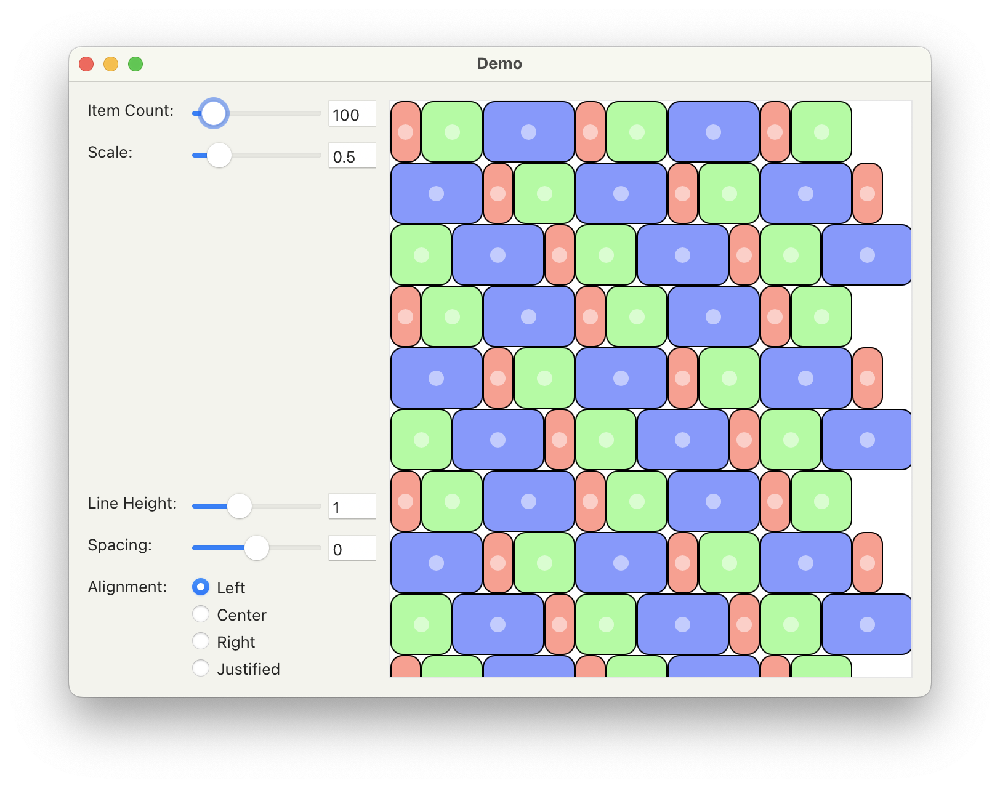

# ezui Demos

A collection of demos for creating interfaces with ezui that are too complex for the [ezui documentation](https://typesupply.github.io/ezui/index.html).

**Contributions are welcome!**

Don't see what you are looking for? Request a demo on the [RoboFont Discord](https://discord.com/channels/1052516637489766411/1076154772362641539).

## `MerzCollectionView/Basic Typesetter.py`
A very basic, unoptimized typesetter.

Relevant Documentation:

    - MerzCollectionView: https://typesupply.github.io/merz/views/merzCollectionView.html
    - Subscriber: https://robofont.com/documentation/reference/api/mojo/mojo-subscriber/

----

## `MerzCollectionView/Basic.py`
Put simple items into a MerzCollectionView.

Relevant Documentation:

    - MerzCollectionView: https://typesupply.github.io/merz/views/merzCollectionView.html

----

## `MerzView/Custom Cursor.py`
Set a cursor for a MerzView.

Relevant Documentation:
    - MerzView: https://typesupply.github.io/merz/views/merzView.html

----

## `MerzView/Interactive Layers.py`
Allow a user to move layers around.

Relevant Documentation:
    - MerzView: https://typesupply.github.io/merz/views/merzView.html

----

## `MerzView/Magnify Event With Focal Point.py`
Change the scale in a MerzView with a magnifyWithEvent
delegate method. The initial point in the magnifyWithEvent
will be used as the focal point so that the content
at that point will remain visible.

Relevant Documentation:
    - ScrollingMerzView: https://typesupply.github.io/merz/views/merzView.html#scrollingmerzview
    - NSEvent.magnification: https://developer.apple.com/documentation/appkit/nsevent/1531642-magnification?language=objc
    - NSEvent.phase: https://developer.apple.com/documentation/appkit/nsevent/1533550-phase?language=objc

----

## `MerzView/Magnify Event.py`
Change the scale in a MerzView with a magnifyWithEvent
delegate method. Note: this does not center the scaled
content at the center point of the event. That is a more
complex operation that will be shown in a different demo.

Relevant Documentation:
    - MerzView: https://typesupply.github.io/merz/views/merzView.html
    - NSEvent.magnification: https://developer.apple.com/documentation/appkit/nsevent/1531642-magnification?language=objc

----

## `Popover/popover at button.py`
Open a popover for a specific button.

Relevant Documentation:
    - Popover: https://typesupply.github.io/ezui/windows.html#ezpopover

----

## `SegmentButton/Varied Segment Widths.py`
Set different widths for segments.

Note: The segmentDescriptions created from the text
description do not merge with the segmentDescriptions
given in the descriptionData, so the segment contents
have to be redefined.

Relevant Documentation:
    - SegmentButton: https://typesupply.github.io/ezui/items.html#segmentbutton

----

## `Slider/End Editing Callback.py`
Define a callback for when a slider's editing ends
in adddition to continuous updates during editing.
This uses a coalescer like the one in Subscriber
to delay being notified by the slider's continuous
callbacks. This doesn't definitively tell you when
the slider has ended, but it's a close approximation.

Discord discussion: https://discord.com/channels/1052516637489766411/1076154772362641539/1157070115922251926

----

## `Table/Cell Types.py`
Use complex cell types in a table.

Relevant Documentation:
    - Table: https://typesupply.github.io/ezui/items.html#ezui.Table

----

## `Table/String Formatting.py`
Apply string formatting to values in a table.

Relevant Documentation:
- Table: https://typesupply.github.io/ezui/items.html#ezui.Table
- Value Conversion and Formatting: https://typesupply.github.io/ezui/tools.html#value-conversion-and-formatting

----

## `TextField/Monospaced Font.py`
Set the font in a field to the system's monospaced font.

Relevant Documentation:
    - TextField.setFont: https://typesupply.github.io/ezui/items.html#ezui.TextField.setFont
    - makeFont: https://typesupply.github.io/ezui/tools.html#ezui.makeFont

----

## `WindowController/Glyph Editor Controller Window.py`
Make a WindowController that communicates with
multiple glyph editor subscribers.

Relevant Documentation:
    - Subscriber: https://robofont.com/documentation/reference/api/mojo/mojo-subscriber/

----

## `WindowController/Show Panel with Window.py`
Make a panel visible only when a window has focus.

This is done by using the vanilla window bindings
that aren't (yet?) exposed in ezui.

Relevant Documentation:
- EZWindow and EZPanel: https://typesupply.github.io/ezui/windows.html
- Window.bind: https://vanilla.robotools.dev/en/latest/objects/Window.html#vanilla.Window.bind

----

## `WindowController/Subscriber Window.py`
Make a WindowController that is also a Subscriber.

Relevant Documentation:
    - subscriber: https://robofont.com/documentation/reference/api/mojo/mojo-subscriber/
    - WindowController: https://typesupply.github.io/ezui/controllers.html#windowcontroller

----

## `WindowController/Window Notifications.py`
Make a WindowController that notifies its subclass
when the window is selected, deselected, closed,
resized or moved.

Relevant Documentation:
    - WindowController: https://typesupply.github.io/ezui/controllers.html#windowcontroller

----

